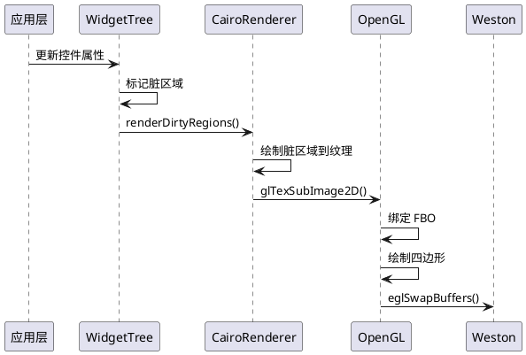
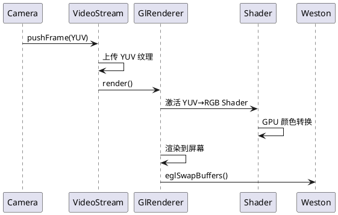
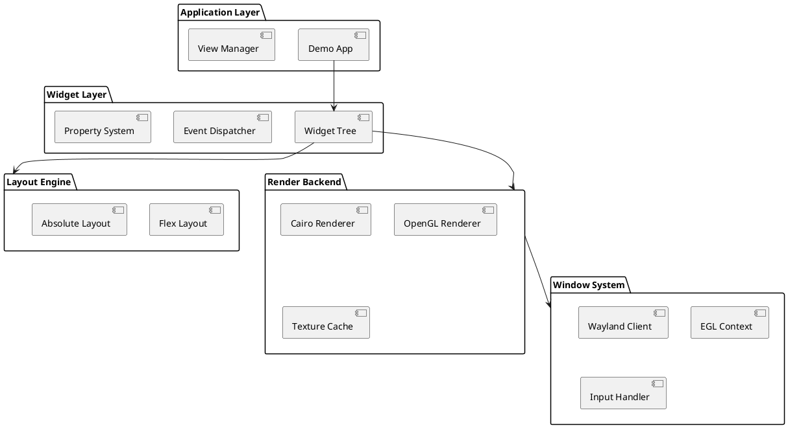
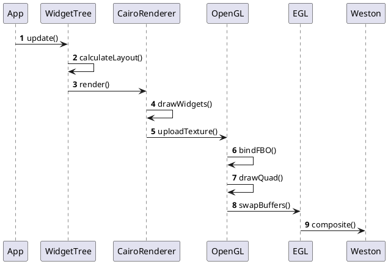

# RenderUI 系统架构设计文档

## 文档信息

| 项目 | 内容 |
|------|------|
| 文档类型 | 系统架构设计 |
| 版本 | v1.0 |
| 创建日期 | 2026-03-29 |

---

## 一、架构概述

### 1.1 设计思想

RenderUI 采用**分层架构**和**场景图（Scene Graph）模式**，核心设计理念：

1. **渲染与逻辑分离**：UI 逻辑层与渲染层完全解耦
2. **按需渲染**：静态控件仅在状态变化时渲染，视频流每帧渲染
3. **GPU 优先**：阶段四全面启用 GPU 加速
4. **异步流水线**：纹理上传与渲染并行执行

### 1.2 架构分层

```
┌─────────────────────────────────────────────────────────┐
│              Application Layer (应用层)                  │
│         Demo 业务逻辑 / 视图切换 / 数据绑定               │
├─────────────────────────────────────────────────────────┤
│              Widget Layer (控件层)                        │
│    Scene Graph / 控件树 / 属性系统 / 事件处理器          │
├─────────────────────────────────────────────────────────┤
│              Layout Engine (布局引擎)                     │
│         Flexbox 风格布局 / 绝对定位 / 约束布局            │
├─────────────────────────────────────────────────────────┤
│           Render Backend (渲染后端)                       │
│   Cairo 渲染器 | Skia 渲染器 | OpenGL 渲染器 | 3D 渲染器  │
├─────────────────────────────────────────────────────────┤
│          Window System (窗口系统)                         │
│      Wayland Client / EGL 上下文 / 窗口管理              │
├─────────────────────────────────────────────────────────┤
│             Platform Layer (平台层)                       │
│          Linux / ARM64 / DRM/KMS / Input                 │
└─────────────────────────────────────────────────────────┘
```

---

## 二、核心模块设计

### 2.1 模块划分

```
renderui/
├── core/                    # 核心模块
│   ├── Application.cpp      # 应用入口与主循环
│   ├── ApplicationContext.cpp # 全局上下文
│   ├── EventLoop.cpp        # 事件循环
│   └── Logger.cpp           # 日志系统
│
├── window/                  # 窗口管理
│   ├── WindowManager.cpp    # 窗口创建与管理
│   ├── Window.cpp           # 窗口对象
│   ├── Surface.cpp          # Wayland Surface
│   └── EglContext.cpp       # OpenGL 上下文
│
├── widget/                  # 控件系统
│   ├── Widget.cpp           # 控件基类
│   ├── WidgetTree.cpp       # 控件树管理
│   ├── widgets/             # 具体控件实现
│   │   ├── Button.cpp
│   │   ├── Label.cpp
│   │   ├── ImageView.cpp
│   │   ├── VideoStream.cpp
│   │   └── Model3D.cpp
│   └── events/              # 事件处理
│       └── TouchEvent.cpp
│
├── layout/                  # 布局引擎
│   ├── LayoutEngine.cpp     # 布局计算
│   ├── FlexLayout.cpp       # 弹性布局
│   └── AbsoluteLayout.cpp   # 绝对定位
│
├── render/                  # 渲染后端
│   ├── RenderPass.cpp       # 渲染通道
│   ├── CairoRenderer.cpp    # Cairo 后端
│   ├── SkiaRenderer.cpp     # Skia 后端 (阶段四)
│   ├── GlRenderer.cpp       # OpenGL 渲染器
│   ├── TextureCache.cpp     # 纹理缓存
│   └── PboPool.cpp          # PBO 缓冲池 (阶段四)
│
├── resource/                # 资源管理
│   ├── ResourceManager.cpp  # 资源管理器
│   ├── ImageLoader.cpp      # 图片加载
│   └── ModelLoader.cpp      # 3D 模型加载
│
├── data/                    # 数据存储
│   ├── Storage.cpp          # 持久化存储
│   └── Settings.cpp         # 设置管理
│
├── ipc/                     # IPC 通信
│   └──DBusAdapter.cpp      # DBus 适配层
│
└── utils/                   # 工具库
    ├── JsonParser.cpp       # JSON 解析
    ├── Timer.cpp            # 定时器
    └── ThreadPool.cpp       # 线程池
```

### 2.2 关键类设计

#### 2.2.1 Widget 基类

```cpp
class Widget : public std::enable_shared_from_this<Widget> {
public:
    // 生命周期
    virtual ~Widget() = default;
    
    // 属性访问
    virtual void setPosition(float x, float y);
    virtual void setSize(float width, float height);
    virtual void setVisible(bool visible);
    
    // 渲染接口
    virtual bool needsRender() const;  // 是否需要渲染
    virtual void render(RenderContext& ctx);  // 渲染实现
    
    // 事件处理
    virtual bool handleTouchEvent(const TouchEvent& event);
    
    // 树形结构
    void addChild(std::shared_ptr<Widget> child);
    void removeChild(const std::string& childId);
    
protected:
    // 子类重写此方法进行自定义绘制
    virtual void onDraw(Canvas& canvas) = 0;
    
    // 标记脏区域，触发重绘
    void markDirty();
    
private:
    std::string id_;
    Vec2 position_;
    Vec2 size_;
    bool visible_ = true;
    bool dirty_ = false;
    std::vector<std::shared_ptr<Widget>> children_;
    std::weak_ptr<Widget> parent_;
};
```

#### 2.2.2 VideoStream 控件

```cpp
class VideoStream : public Widget {
public:
    // 视频帧输入
    void pushFrame(const VideoFrame& frame);
    
    // 视频流始终需要渲染
    bool needsRender() const override { return true; }
    
    // YUV→RGB 转换 + OpenGL 纹理上传
    void onDraw(Canvas& canvas) override;
    
private:
    void updateYuvTexture(const VideoFrame& frame);
    
    uint32_t textures_[3];  // Y/U/V 纹理
    std::mutex frameMutex_;
    VideoFrame latestFrame_;
    bool newFrameAvailable_ = false;
};
```

#### 2.2.3 RenderContext 渲染上下文

```cpp
class RenderContext {
public:
    // 获取 Cairo 绘图表面（阶段一、二）
    cairo_t* getCairoContext();
    
    // 获取 Skia 画布（阶段四）
    SkCanvas* getSkCanvas();
    
    // OpenGL 操作
    GLuint getFbo();
    void bindTexture(GLuint texture);
    
    // 提交渲染
    void commit();
    
private:
    EGLDisplay display_;
    EGLSurface surface_;
    GLuint fbo_;
    cairo_t* cairo_ = nullptr;
    std::unique_ptr<SkSurface> skia_;
};
```

---

## 三、渲染流程

### 3.1 静态控件渲染流程（按需渲染）



### 3.2 视频流渲染流程（每帧渲染）



### 3.3 混合渲染优化策略

**问题**：静态控件与视频流混合时，如何避免重复渲染？

**解决方案**：双层 FBO 策略

```
┌─────────────────────────────────────┐
│  Final Composite FBO (提交 Weston)   │
├─────────────────────────────────────┤
│  Video Layer FBO (每帧更新)          │
├─────────────────────────────────────┤
│  UI Layer FBO (按需更新)             │
└─────────────────────────────────────┘
```

- **UI Layer**: 所有静态控件渲染到此 FBO，仅当 `dirty=true` 时更新
- **Video Layer**: 视频流渲染到独立 FBO，每帧更新
- **Composite**: 将两层合成，提交给 Weston

---

## 四、数据结构设计

### 4.1 场景图节点

```cpp
struct SceneNode {
    std::string id;
    NodeType type;  // WIDGET, CONTAINER, VIDEO, MODEL3D
    
    // 变换矩阵
    glm::mat4 transform;
    glm::mat4 inverseTransform;
    
    // 边界框
    Rect bounds;
    Rect clipRect;
    
    // 渲染状态
    RenderState state;
    bool isDirty;
    
    // 子节点
    std::vector<std::shared_ptr<SceneNode>> children;
    std::weak_ptr<SceneNode> parent;
};
```

### 4.2 JSON 配置格式

```json
{
  "window": {
    "title": "RenderUI Demo",
    "width": 1920,
    "height": 1080,
    "position": {"x": 0, "y": 0}
  },
  "theme": "dark",
  "locale": "zh-CN",
  "widgets": [
    {
      "id": "background",
      "type": "Background",
      "image": "assets/bg_dark.png",
      "zIndex": 0
    },
    {
      "id": "video_container",
      "type": "Container",
      "layout": "absolute",
      "children": [
        {
          "id": "camera_front",
          "type": "VideoStream",
          "source": "camera://front",
          "position": {"x": 100, "y": 100},
          "size": {"width": 640, "height": 480}
        }
      ]
    },
    {
      "id": "speed_label",
      "type": "Label",
      "text": "${vehicle.speed} km/h",
      "fontSize": 24,
      "color": "#FFFFFF",
      "position": {"x": 50, "y": 50},
      "bindings": [
        {"signal": "vehicle.speed", "property": "text"}
      ]
    }
  ]
}
```

---

## 五、关键技术实现

### 5.1 Wayland 窗口创建

```cpp
class WaylandWindow {
public:
    void create() {
        // 1. 连接 Wayland 显示器
        display_ = wl_display_connect(nullptr);
        
        // 2. 获取 compositor
        registry_ = wl_display_get_registry(display_);
        wl_registry_add_listener(registry_, &registryListener, this);
        
        // 3. 创建 surface
        surface_ = wl_compositor_create_surface(compositor_);
        
        // 4. 创建 xdg_toplevel (窗口)
        xdgSurface_ = xdg_wm_base_get_xdg_surface(wmBase_, surface_);
        toplevel_ = xdg_surface_get_toplevel(xdgSurface_);
        
        // 5. 配置窗口大小
        xdg_toplevel_set_title(toplevel_, "RenderUI");
        xdg_toplevel_set_app_id(toplevel_, "com.renderui.demo");
        
        // 6. 创建 EGL 表面
        eglSurface_ = eglCreateWindowSurface(eglDisplay_, config, surface_, nullptr);
    }
};
```

### 5.2 YUV 纹理上传

```cpp
void VideoStream::uploadYuvTexture(const VideoFrame& frame) {
    // 使用 PBO 异步上传（阶段四）
    if (usePbo_) {
        glBindBuffer(GL_PIXEL_UNPACK_BUFFER, pboIds_[0]);
        glBufferData(GL_PIXEL_UNPACK_BUFFER, frame.ySize(), frame.yData(), GL_STREAM_DRAW);
        glTexSubImage2D(GL_TEXTURE_2D, 0, 0, 0, width, height, GL_LUMINANCE, GL_UNSIGNED_BYTE, 0);
    } else {
        // CPU 直接上传（阶段一、二）
        glActiveTexture(GL_TEXTURE0);
        glBindTexture(GL_TEXTURE_2D, yTexture_);
        glTexImage2D(GL_TEXTURE_2D, 0, GL_LUMINANCE, width, height, 0, 
                     GL_LUMINANCE, GL_UNSIGNED_BYTE, frame.yData());
    }
}
```

### 5.3 DBus 调试接口

```cpp
class DBusAdapter {
public:
    void init() {
        // 连接 DBus
        conn_ = g_bus_get_sync(G_BUS_TYPE_SYSTEM, nullptr, nullptr);
        
        // 导出对象供调试工具调用
        g_dbus_connection_register_object(
            conn_,
            "/com/renderui/debug",
            interface_info,
            &vtable,
            this,
            nullptr,
            nullptr
        );
    }
    
private:
    static void onMethodCall(...) {
        // 处理调试方法调用
        // 例如：截图、日志导出、性能数据等
    }
};
```

**DBus 用途:**
- 调试工具集成
- 日志导出
- 远程截图
- 性能数据监控
        ApplicationContext::instance()->postEvent(
            SignalEvent{"vehicle.speed", std::to_string(speed)}
        );
    }
};
```

---

## 六、性能优化方案

### 6.1 渲染优化

| 优化项 | 阶段 | 预期收益 |
|--------|------|----------|
| 脏矩形渲染 | 一 | 减少 70% 绘制调用 |
| 纹理缓存 | 二 | 避免重复加载 |
| PBO 双缓冲 | 四 | CPU-GPU 并行 |
| 批处理绘制 | 二 | 减少状态切换 |
| LOD 多细节层次 | 三 | 3D 模型性能提升 |

### 6.2 内存优化

```cpp
// 资源管理器自动清理未使用纹理
class ResourceManager {
public:
    void cleanupUnusedTextures() {
        auto now = std::chrono::steady_clock::now();
        for (auto& [path, tex] : textures_) {
            if (tex.lastAccessTime + TTL < now) {
                glDeleteTextures(1, &tex.id);
                textures_.erase(path);
            }
        }
    }
    
private:
    static constexpr auto TTL = std::chrono::minutes(5);
};
```

### 6.3 帧率监控

```cpp
class FpsCounter {
public:
    void recordFrame() {
        frames_++;
        auto now = Clock::now();
        auto elapsed = std::chrono::duration<float>(now - lastTime_).count();
        
        if (elapsed >= 1.0f) {
            fps_ = frames_ / elapsed;
            frames_ = 0;
            lastTime_ = now;
            
            // 记录日志
            LOG_I << "FPS: {}" << fps_;
        }
    }
    
private:
    int frames_ = 0;
    float fps_ = 0;
    Clock::time_point lastTime_;
};
```

---

## 七、调试工具设计

### 7.1 键盘调试菜单

```
按下 F1 打开调试菜单：

[RenderUI Debug Menu]
1. Toggle FPS Display     (当前：ON)
2. Show Draw Calls        (当前：OFF)
3. Show Memory Usage      (当前：156MB)
4. Dump Scene Graph       (输出到日志)
5. Reload Config          (热重载 JSON)
6. Simulate CAN Signal    (模拟车速信号)
7. Switch Theme           (切换主题)
8. Language: 中文/English
0. Close Menu

当前帧率：59.8 FPS
渲染耗时：2.3ms
```

### 7.2 Perfetto Trace 集成

```cpp
#define TRACE_EVENT(name) perfetto::TrackEvent::ScopedInstant(name)

void Widget::render(RenderContext& ctx) {
    TRACE_EVENT("Widget::render");
    // ... 渲染代码
}

void VideoStream::pushFrame(const VideoFrame& frame) {
    TRACE_EVENT("VideoStream::pushFrame");
    // ... 帧处理代码
}
```

---

## 八、扩展性设计

### 8.1 渲染器抽象

```cpp
class IRenderer {
public:
    virtual ~IRenderer() = default;
    virtual void beginFrame() = 0;
    virtual void drawWidget(Widget* widget) = 0;
    virtual void endFrame() = 0;
};

// Cairo 实现（阶段一）
class CairoRenderer : public IRenderer {
    // ...
};

// Skia 实现（阶段四）
class SkiaRenderer : public IRenderer {
    // ...
};
```

### 8.2 存储抽象

```cpp
class IStorage {
public:
    virtual void set(const std::string& key, const std::string& value) = 0;
    virtual std::optional<std::string> get(const std::string& key) = 0;
};

// 简单文件存储（阶段二）
class FileStorage : public IStorage {
    // ...
};

// LevelDB 存储（阶段四）
class LevelDbStorage : public IStorage {
    // ...
};
```

---

## 九、构建系统

### 9.1 CMake 结构

```cmake
cmake_minimum_required(VERSION 3.20)
project(RenderUI VERSION 0.1.0 LANGUAGES CXX)

set(CMAKE_CXX_STANDARD 20)
set(CMAKE_EXPORT_COMPILE_COMMANDS ON)

# 依赖查找
find_package(PkgConfig REQUIRED)
pkg_check_modules(WAYLAND REQUIRED wayland-client wayland-protocols)
pkg_check_modules(EGL REQUIRED egl)
pkg_check_modules(GLES REQUIRED glesv2)
pkg_check_modules(CAIRO REQUIRED cairo)
pkg_check_modules(DBUS REQUIRED dbus-1)

# 子目录
add_subdirectory(src/core)
add_subdirectory(src/window)
add_subdirectory(src/widget)
add_subdirectory(src/render)
add_subdirectory(src/resource)

# 可执行文件
add_executable(renderui_demo src/main.cpp)
target_link_libraries(renderui_demo 
    RenderUICore
    ${WAYLAND_LIBRARIES}
    ${EGL_LIBRARIES}
    ${GLES_LIBRARIES}
    ${CAIRO_LIBRARIES}
    ${DBUS_LIBRARIES}
)
```

---

## 十、文件组织

```
docs/
├── requirements/
│   └── PRD.md              # 产品需求文档
├── architecture/
│   ├── system_design.md    # 本文档
│   ├── rendering_flow.plantuml
│   └── module_diagram.plantuml
├── api/
│   └── api_reference.md    # API 参考手册
└── guides/
    ├── getting_started.md  # 入门指南
    └── tutorial.md         # 教程
```

---

## 附录：PlantUML 图表源码

### A.1 系统架构图



### A.2 渲染时序图


